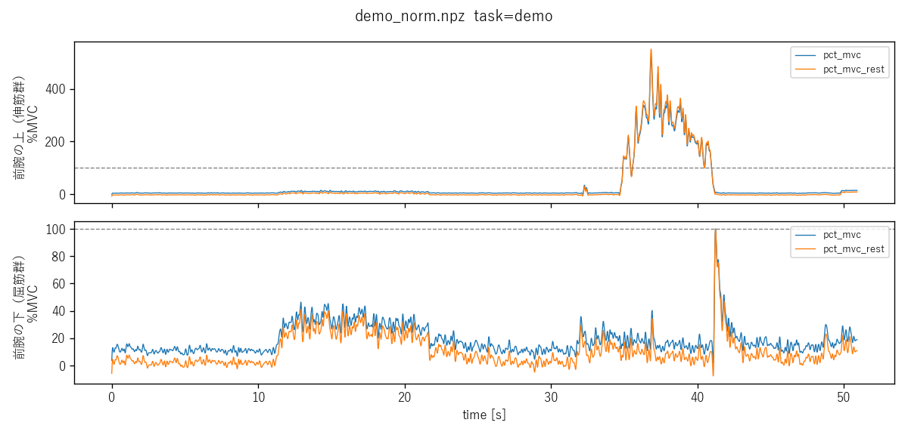
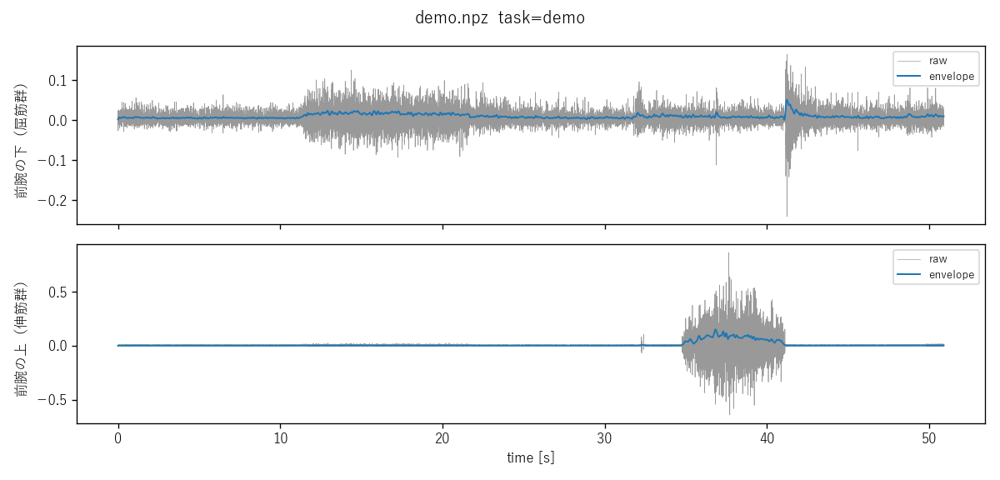

# 成果報告 2026-10-01

## 1. Python で EMG を取り、MVC で正規化するコード

**やったこと**

- Trigno から Delsys API で EMG を取得し、ファイルに保存するコードを書いた
- MVC の測定手順を決めて実装した（安静 10 秒 → 手首伸展・屈曲を各 5 秒 × 3 試行、試行間 60 秒休憩）。画面の案内に従うだけで、毎回同じ手順になる
- MVC で正規化するところまで実装した（%MVC と、安静の値を差し引いた %MVC の 2 種類）
- 機材なしで試せるよう疑似信号でも動かせるようにし、取得 → MVC 測定 → 正規化 → 波形表示 まで通しで動くことを確認した

**わかったこと**

- 研究室の Trigno は Trigno Discover 世代で、データの取得に Delsys API を使う必要がある
- Delsys API は、Delsys が発行するキーとライセンスがないと使えない。実機で動かすのに足りないのはこれだけ

**次やること**

- キーとライセンスを入手する → 問い合わせメールの文面を作り、先生に渡した（返事待ち）
- 届いたら実機に API で接続し、Discover と同じ設定（Avanti、2148.1 Hz）で取れるか確認する

## 2. キーを待つあいだ、Trigno Discover でデモデータを取る

**やったこと**

- Trigno Discover で前腕 2 か所（伸筋側・屈筋側）のデモデータを取り、CSV に書き出した（09-29）
  - 安静 10 秒、手首伸展の MVC、手首屈曲の MVC、デモ（脱力と力みを交互に）を各 1 本
  - 動作の始まりと終わりには Discover のマーカーを付けた

**わかったこと**

- センサは Avanti で、EMG のサンプリング周波数は 2148.1 Hz
- 伸筋側と屈筋側は、標準センサでもきれいに分かれた。伸展の MVC では伸筋側だけ、屈曲の MVC では屈筋側だけが反応した
- マウスを握る力みは屈筋側にだけ出て、伸筋側にはほとんど出なかった。伸筋側が反応するのは、手首を反らす・固める方向の力

**次やること**

- 前腕 2 か所で区別がつくとわかったので、次は 6 か所（4 章）に付けて取り、ほかの部位でも力みの種類が分かれるかを見る

## 3. CSV を読み込み、MVC で正規化する

**やったこと**

- Discover の CSV を読み込むコマンド（`import-csv`）を作り、デモデータを MVC 正規化して図にするところまで通した
  - マーカーの間だけを自動で切り出し、センサ番号を部位名（日本語）に付け替える
  - API で取った記録と同じ形式（.npz）にそろえるので、キーが届いたあとも後ろの処理はそのまま使える

0〜10 秒 脱力 → 11〜21 秒 マウスを握る → 22〜31 秒 脱力 → 34〜40 秒 手首を手のひら側に曲げきる → 41 秒〜 脱力。
青が %MVC、橙が安静の値を差し引いた %MVC。点線が 100 %MVC。

**わかったこと**

- **今の MVC の取り方では、伸筋側の最大を捉えきれていない**
  - 手首を手のひら側に曲げきったとき、伸筋側が伸展の MVC の約 3.5 倍（包絡線 97 μV 対 28 μV）まで上がり、正規化すると約 350 %MVC（瞬間では 500% 超）になった
  - ノイズではなく本物の筋活動（周波数の中央値 168 Hz、20 Hz 未満の成分 0.3%。MVC の記録と同じ性質）
- 屈筋側は、脱力していても約 10 %MVC ある。安静の値（MVC の約 9%）がそのまま「床」として出ていて、安静を引いた %MVC ではほぼ 0 になる

**次やること**

- MVC の取り方を見直してから本番データを取る
  - 伸展の MVC を、しっかり固定できる方法（机の天板の裏に手の甲を当てて押し上げる など）で取り直す
  - 取り直しても 100 %MVC を超える動きが残るなら、その動きを MVC の課題に加える

## 4. 電極を貼る筋を決める

**やったこと**

- 電極を貼る筋を 6 か所に決めた（詳細は補足メモ）
  - 前腕の伸筋群・屈筋群、三角筋中部、上腕二頭筋、上腕三頭筋、僧帽筋上部
  - 僧帽筋上部だけは、指標を探す期間に限って試す

**わかったこと**

- 上腕の二頭筋と三頭筋は大きく離れているので、前腕と違って標準センサでも別々に拾える。肘の共収縮なら素直に見られる
- 僧帽筋上部はバンドで固定できず貼り付けになるので、毎日付けるには負担が大きい

**次やること**

- 6 か所に付けて本番のデータを取り、正規化した波形を見る
- 波形を見て、指標の候補（静止区間の残余活動 / 区画レベルの共収縮 / 振幅の変動性）を絞る

---

## 補足メモ

- **前回（09-24）決めたこと**：指標の定義は生データを見てから決める。その前段として、10月中に「Trigno から Python で生データを取り、MVC で正規化するところまで」を終わらせる。今週はそのコード部分をやった
- **MVC（最大随意収縮）**：その筋で出せる最大の力を出したときの筋活動。日によって電極を貼る位置が変わるため、その日の MVC で割って %MVC にしないと、日をまたいで比べられない
- **安静参照**：マウスに手を置いたまま静止した状態の筋活動。座り方などで日ごとに変わる「床」の高さを補正するために使う
- **正規化を2種類残す理由**：安静の値を引くと、姿勢の違いによる影響は消せる。一方で、指標候補の「静止区間の残余活動（力み）」まで消えてしまう可能性がある。どちらを使うかは、波形を見て決める
- **MVC の値の取り方**：伸展・屈曲の全試行を通して、最も大きかったところ（0.5秒平均）をそのチャネルの MVC とする。センサが大きく、筋を1つずつ分けて拾えないため、どの課題で最大になるかはチャネルに任せる
- **Trigno の世代による違い**：従来型（Trigno Control Utility）はライセンスなしで TCP 通信で取得できるが、Trigno Discover 世代はライセンス付きの Delsys API でしか取得できない
- **コードの場所**：`analysis/emgpipe/`。使い方は `analysis/README.md`
- **電極を貼る筋**：探索期間は多めに付け、毎日の練習用には効いたものだけ残す。生データを見る前に絞ると、見落としたかどうかも判断できないため

  | # | 部位 | 筋 | 付け方 | 見たいもの |
  | --- | --- | --- | --- | --- |
  | 1 | 前腕の上 | 伸筋群 | 前腕バンド | 手首を固める力み |
  | 2 | 前腕の下 | 屈筋群 | 前腕バンド | 手首を固める力み・握り込み |
  | 3 | 肩 | 三角筋中部 | 上腕バンド（肩寄り） | 腕の浮き・脇の開き |
  | 4 | 上腕の表 | 上腕二頭筋 | 上腕バンド | 肘を固める力み（三頭筋との共収縮） |
  | 5 | 上腕の裏 | 上腕三頭筋 | 上腕バンド | 同上 |
  | 6 | 首と肩のあいだ | 僧帽筋上部 | 貼り付け | 肩のすくみ（緊張）。探索期間だけ |

  - 二頭筋と三頭筋は大きく離れているので、前腕と違って標準センサでも別々に拾える。肘の共収縮なら素直に見られる
  - 僧帽筋上部はバンドで固定できず、毎日付けるには負担が大きい。効いていそうなときだけ残す
  - 前腕に親指側・小指側を足す案（最大 8 個まで使える）もあるが、クロストークで分けにくく情報が増えにくいので、まず 6 個で見る
- **MVC の課題**：付ける筋が増えたので、全力を出す課題も 6 つに増やす。どの課題で最大になったかはチャネルごとに自動で選ぶ

  | 課題 | 主に使う筋 |
  | --- | --- |
  | 手首の伸展 | 前腕の伸筋群 |
  | 手首の屈曲 | 前腕の屈筋群 |
  | 腕を横に 90° 上げ、上から押さえてもらって全力で持ち上げる | 三角筋中部 |
  | 肘を曲げる方向に全力 | 上腕二頭筋 |
  | 肘を伸ばす方向に全力 | 上腕三頭筋 |
  | 肩を上から押さえてもらって全力ですくめる | 僧帽筋上部 |
- **MVC が 100% を超えた件**：09-29 のデモデータ（`data/raw/2026-09-29/`、Git 管理外）

  | 記録 | 伸筋側の包絡線 | 屈筋側の包絡線 |
  | --- | --- | --- |
  | 安静 | 2 μV | 4〜8 μV |
  | 伸展の MVC（机に固定した手を、反対の手で押さえて反らす） | 17〜28 μV | 4〜5 μV |
  | 屈曲の MVC（机に置いた手を、下に押し下げる） | 3 μV | 37〜45 μV |
  | デモ：マウスを握り込む | 3 μV | 15〜19 μV |
  | デモ：マウスを離し、手首を手のひら側に曲げきる | **48〜97 μV** | 10 μV |

  - 包絡線は 1 秒ごとの平均。MVC と安静の比は伸筋側 14 倍、屈筋側 9 倍で、コードの警告基準（5 倍未満）はクリアしている
  - 考えられる理由は 2 つで、たぶん両方：
    - 反対の手で押さえるやり方では、伸展の力を出し切れていない
    - 手首を曲げきるとき、伸筋側の筋（指の伸筋など）が引き伸ばされながら強く働く
  - MVC は「その日の最大」で割るための基準なので、実際の動きのほうが大きいと %MVC が 100% を超え、日をまたいだ比較の土台が崩れる。取り方を固めてから本番データを取る
- **デモの生波形**：正規化前の生波形（灰）と包絡線（青）。単位は mV

  

  - 41 秒で屈筋側に一瞬だけ大きな振れ（約 100 %MVC）がある。曲げきった手首を戻した瞬間で、戻す動きの筋活動か、手が机に当たったノイズかはまだ切り分けていない
- **CSV 読み込みの使い方**：`python -m emgpipe import-csv <フォルダ>`。フォルダの `sensors.json` に「部位 → センサ番号」を書いておく（例 `{"前腕の上（伸筋群）": 3, "前腕の下（屈筋群）": 0}`）
