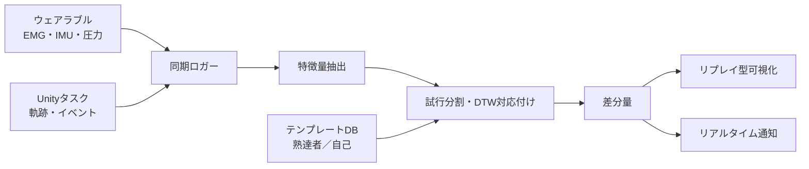

# ウェアラブル生体計測によるエイムスキル学習支援システム 研究計画書

- 作成日: 2026-09-21
- 対象: 修士研究（M1 / 2028年3月修了予定）
- ステータス: 方針転換案。指導教員への相談用

---

## 1. 研究の背景と問題意識

FPSのエイム練習を支援する既存手法は、マウス軌跡や命中率といった画面上に現れる結果だけを見ており、
それを生み出した身体の使い方を見ていない。

KovaaK's や Aim Lab に代表されるエイムトレーナーは、命中率・反応時間・軌跡といった指標を提示する。
しかしこれらはすべて運動の出力側の情報である。同じ軌跡を描いていても、手首主導で振っているか
腕全体で振っているか、どの程度の力みを伴っているかは学習者ごとに大きく異なり、その差は画面に
一切表示されない。学習者は自分の身体の使い方を客観的に知る手段を持たないまま、反復練習によって
自己流で気づくことを強いられている。

本研究の出発点は、熟達者と初学者では筋活動のパターンが系統的に異なるという運動学習の知見にある。
新奇な運動課題の初期段階では拮抗筋の同時収縮によって関節を固め、誤差を抑え込む方略がとられるが、
内部モデルの獲得が進むにつれて同時収縮は減少する。すなわち「余計な力みがない状態」は熟達の
指標として身体に現れる。

### 解決したい実務上の問題

この研究が解こうとしているのは、エイム上達に**科学的な裏付けのあるトレーニング方法が確立されていない**
ことによって生じる、次の2つの実害である。

**1. 長時間練習への依存。** 何をどう練習すれば上達するかが分からないため、量でしか解決できない。
プレイヤーは効果が不確かなまま長時間の反復に時間を費やしており、上達効率が練習時間に見合っていない。
過剰な練習時間は手首・前腕の慢性的な負担にもつながる。

**2. 「調子」に振り回されること。** 日によってパフォーマンスが変動するが、その原因が本人に見えない。
調子が悪いときに何が崩れているのかも、良いときに何ができていたのかも分からないため、立て直す手段が
なく、回復を待つしかない。

いずれも根は同じで、**自分の状態を客観的に観測する手段がない**ことにある。画面上の結果（命中率）は
崩れたことを教えてくれるが、何がどう崩れたのかは教えてくれない。本研究が身体側を計測する動機はここに
ある。身体の使い方を観測できれば、練習は「量をこなす」から「ずれている点を直す」に変わり、調子の変動は
「原因不明の波」から「基準との差」になる。

この動機は評価設計にも反映する。命中率の最終到達点だけでなく**練習時間あたりの上達率**を見ること、
そして自己基準テンプレート（第8章）を単なるリスクヘッジではなく**調子の変動に対する解**として
位置づけることが、この問題意識から導かれる。

### 中間発表で受けた指摘への対応

中間発表では「脱力できるからパフォーマンスが上がるのか、パフォーマンスが高いから脱力できているのか」
という因果の向きに関する指摘を受けた。この指摘は妥当であり、運動学習の知見に照らせば後者、つまり
脱力は熟達の結果として現れる側面が強いと考えられる。

本研究はこの指摘を前提として受け入れ、研究の枠組みを組み替える。脱力を訓練すべき原因としてではなく、
**熟達度が身体に現れた読み取り可能な指標**として扱う。結果として現れるものだからこそ、それを計測すれば
学習者と熟達者の差を捉えることができ、その差を本人に見せることが支援になる。因果の向きに関する主張を
一切必要としない設計とすることで、指摘された論点を回避するのではなく、システムの設計根拠へと転換する。

---

## 2. 研究目的と新規性

本研究の目的は、ウェアラブル生体計測によってエイム中の身体の使い方を捉え、熟達者または自己の成功試行
との差分を学習者に提示するシステムを構築し、その学習促進効果を検証することである。

中核となる主張は次の一文に集約される。

> エイム練習において、身体側を計測して初めて見える差がある。それを可視化した支援システムは現存しない。

この主張は仮説の新規性ではなくシステムの新規性であるため、先行事例の網羅によって成否を判定できる。

### 貢献

1. **エイム動作のウェアラブル計測系の構築**。前腕筋電・IMU・グリップ圧をマウス軌跡・タスクイベントと
   同期記録する、装着負荷の小さい計測環境を作る。
2. **身体の使い方の差分算出手法の提案**。試行間で長さの異なる多チャンネル時系列を対応付け、
   学習者が解釈できる粒度の差分量として出力する。
3. **差分提示の学習効果の検証**。従来型の軌跡フィードバックのみを統制群とし、身体情報を見せることの
   上乗せ効果を測る。

### リサーチクエスチョン

- **RQ1**: マウス軌跡が同等でも、身体側の信号には熟達度や試行の成否と対応する差異が現れるか。
- **RQ2**: その差分を提示することで、軌跡のみを提示する場合より学習が促進されるか。
- **RQ3**: 差分の基準は他者（熟達者）と自己（自分の成功試行）のどちらが有効か。

---

## 3. 関連研究

最も重要な先行研究は熟練者のEMGパターンとの類似度をフィードバックすると学習が促進されることを
示した研究であり、本研究はこれをウェアラブル化し、実タスクへ拡張する位置づけとなる。

| 領域 | 主な知見 | 本研究との関係 |
| --- | --- | --- |
| 運動学習と同時収縮 | 学習初期は拮抗筋の同時収縮で関節を固め、内部モデル獲得とともに減少する（[Heald 2018](https://www.nature.com/articles/s41598-018-34737-5)） | 脱力を「熟達の結果」と位置づける理論的根拠 |
| 筋活動の安定化 | 手の巧緻性の学習に伴い、EMGの時間的・量的変動性が減少する（[Yamamoto 2020](https://journals.plos.org/plosone/article?id=10.1371%2Fjournal.pone.0236254)） | 差分指標に変動性を含める根拠 |
| EMGフィードバック | 熟練者のEMGパターンとの類似度を提示すると、複雑な運動スキルの学習が促進される（[Front Hum Neurosci 2022](https://pmc.ncbi.nlm.nih.gov/articles/PMC9897456/)） | 最重要の先行研究。手法の有効性の根拠であり、同時に差別化すべき対象 |
| 射撃・アーチェリー | 熟達者は姿勢制御と筋活動が経済的で、発射前の生体信号に特徴的なパターンを持つ | エイムに最も近い領域。指標設計の参考 |
| eスポーツのバイオフィードバック | 脳活動・視線のバイオフィードバック訓練で射撃時間が30〜47ms短縮（[Comput Human Behav 2025](https://www.sciencedirect.com/science/article/pii/S0747563225002833)） | eスポーツへの生体信号応用の先例。シャム統制群の設計を参照 |
| FPSへのHCI的介入 | 電気筋肉刺激による射撃タイミングの訓練（[ACM 2023](https://dl.acm.org/doi/10.1145/3611067)） | 身体を介したFPS支援の系譜。本研究は刺激ではなく可視化でアプローチ |
| エイムトレーナー | KovaaK's の指標は射撃精度の評価尺度として一定の信頼性を持つ（[pilot study 2024](https://www.ncbi.nlm.nih.gov/pmc/articles/PMC10925653/)） | 自作タスクの妥当性を議論する際の参照点 |

### 先行研究調査で埋めるべき空白

新規性の主張を確定させるため、着手前に次の範囲を網羅する。

- 国際会議: CHI、CHI PLAY、UIST、AHs（Augmented Humans）の過去5年を `skill` `training` `wearable` `EMG` `aim` で網羅
- 国内: WISS、情報処理学会HCI研究会・EC研究会、日本バーチャルリアリティ学会
- 身体スキル伝達系: `motion guidance` `skill transfer` `body movement visualization` で、スポーツ・楽器・伝統芸能領域の手法を確認

特に「熟達者の身体データとの差分を可視化する」手法はスポーツ・楽器領域に多数存在するため、本研究の
差別化は「マウス操作という微小で高速な動作を対象とする点」に置く。

---

## 4. 提案システムの全体構成

システムは、計測層・差分算出層・提示層の3層で構成する。

学習者はウェアラブルを装着してタスクを行い、各試行の身体信号がテンプレートと照合されて差分が
算出され、試行直後のリプレイとプレイ中の即時通知の2経路で返される。

処理は2系統に分ける。**オフライン経路**は試行終了後に全チャンネルを使って精密な差分を出し、
リプレイ型可視化を駆動する。**オンライン経路**は遅延制約が厳しいため、単純な閾値判定に限定する。

---

## 5. 計測系：ハードウェア構成

### 使用機材: Delsys Trigno

研究室に Delsys Trigno システムがあるため、これを中核に据える。当初想定していた有線筋電計と比べ、
本研究にとって条件が大幅に良い。

- **無線・小型センサ**であり、「ウェアラブル」という研究室の要件を機材そのものが満たす
- **Trigno Avanti センサは EMG と9軸IMU（加速度・ジャイロ・磁気）を1つの筐体に内蔵**しているため、
  別途IMUを装着する必要がない。装着点が減り、参加者の負担と準備時間が下がる
- **Trigno SDK による TCP/IP でのリアルタイムストリーミング**に対応しており、外部プログラム
  （Unity / Python）へ逐次データを流せる。これによりリアルタイムフィードバックをEMGで直接実現できる

当初計画では「リアルタイム取得が機材的に不可能かもしれない」ことが最大の技術リスクだったが、
Trigno であればこのリスクはほぼ消える。設計上の制約が1つ外れたことになる。

> 上記のセンサ仕様・SDK仕様は世代と構成で異なるため、保有機材の型番を確認して確定させること。

### センサ構成

| センサ | 装着位置 | 捉えるもの |
| --- | --- | --- |
| Trigno センサ ×2〜4 | 前腕伸筋群（ECR）、前腕屈筋群（FCR）、任意で僧帽筋上部・三角筋 | 力みの量、拮抗筋の同時収縮、力みの時間構造 |
| 上記センサ内蔵IMU | 同上（手首寄りのセンサを主に使用） | 手首主導か腕主導か、微細な揺れ、運動の分節 |
| 感圧センサ（FSR）×2 | マウス側面の拇指接触部、薬指・小指接触部 | グリップ圧。直感的でフィードバックに使いやすい |
| 振動モータ | 前腕バンド内側 | リアルタイムの触覚通知 |

FSRと振動モータは Trigno の系統外になるため、**M5StickC Plus2**（BLE・ADC・数千円）で読み取りと
駆動を行う。当初はM5StickCをIMU取得にも使う想定だったが、Trigno センサに内蔵されているため
役割は補助デバイスに縮小する。

### 着手直後に確認すべきこと（2026年10月前半）

研究室で Trigno を使う最初の利用者となるため、次を確認する調査タスクを置き、**11月末を判断期限**とする。

1. **Trigno SDK / Trigno Control Utility が利用可能か**（ライセンス、対応PC、TCPサーバが起動するか）。
   リアルタイム経路の可否がここで決まる
2. **保有センサの型番と本数**（IMU内蔵の有無が構成を左右する）
3. **同期手段**（Trigger Module または Analog Input Adapter の有無。なければソフトウェア時刻＋遅延実測）
4. **センサ固定用アドヒーシブの在庫と調達経路**。実験直前の欠品は典型的な事故

サンプリングレート等の具体値は構成とファームウェアで変わるため、Trigno Control Utility 上で実測して
確定させる。目安として EMG は約2000 Hz、内蔵IMU は数百 Hz 程度。

---

## 6. 取得データとログ仕様

全信号を共通タイムスタンプ上に並べ、試行単位で切り出せる形で保存する。

| 信号 | レート（目安） | 内容 |
| --- | --- | --- |
| EMG | 約2000 Hz | 各チャンネルの生電位 |
| IMU（センサ内蔵） | 100〜300 Hz | 3軸加速度、3軸角速度 |
| グリップ圧 | 100 Hz | FSR 2系統のADC値 |
| マウス入力 | Raw Input全件 | dx, dy, ボタン状態（ポーリングではなくイベント単位） |
| 画面内状態 | 1フレーム毎 | クロスヘア座標、ターゲット位置・速度 |
| イベント | 発生時 | ターゲット出現、発射、命中判定、試行開始・終了 |

### タスク側の設計

市販エイムトレーナーは同期信号を取り出せないため、**Unityで自作する**。課題は以下の3種とし、
差分が現れやすい課題を実験1で選別する。

- **Flick**: 静止ターゲットへの大振り。初動の正確さと修正回数が出る
- **Tracking**: 移動ターゲットの追尾。持続的な力みが出る
- **Switch**: 連続交戦。発射後の力みの持ち越しが出る

ターゲットの予測可能性（出現位置・タイミングの規則性、移動の予測易さ）をパラメータとして持たせる。
これにより、中間発表で議論になった「予測ができているから脱力できるのか」という問いを、実験1の
副次的な分析として検証できる。

### 時刻同期

同期がずれたデータは後から救えないため、優先順を決めて早期に検証する。

1. **Trigger Module / Analog Input Adapter（最善）**: Unityからのイベント信号をTrignoの記録系に直接入れる
2. **SDKのタイムスタンプ**: ストリーミングAPIが返すサンプル番号・時刻を基準に、Unity側ログと突き合わせる
3. **ソフトウェア時刻＋遅延実測**: NTPで揃えた上で、既知タイミングの信号を入れてズレ量とジッタを測定し補正

いずれの方式でも、11月末に**既知タイミングで信号を入れ、ログ上のずれが許容範囲（目安5ms以内）に
収まることを確認する検証**を必ず実施する。

---

## 7. 信号処理と特徴量

生信号をそのまま比較しても意味をなさないため、各信号を解釈可能な特徴量に落としてから差分を取る。

### EMGの前処理

帯域通過20–450 Hz、電源ハムのノッチ除去、全波整流の後、窓幅50–100 msのRMS包絡を算出する。

**MVC正規化は必須**とする。生の電位振幅は電極位置や皮膚状態で容易に数倍変わるため、正規化なしでは
個人間比較も日をまたいだ比較も成立しない。各セッション冒頭に最大随意収縮の計測を置き、%MVCで
表現する。センサ位置の再現性確保のため、位置のマーキングと撮影を運用に含める。

同時収縮は Falconer & Winter の定義に基づき、拮抗筋ペアの重なりを時刻 t ごとに算出する。

$$
CCI(t) = \frac{2 \cdot \min(EMG_{ext}(t), EMG_{flex}(t))}{EMG_{ext}(t) + EMG_{flex}(t)} \times 100
$$

### 各信号から取る特徴量

| 信号 | 特徴量 | 意味 |
| --- | --- | --- |
| EMG | 安静時RMS、試行中平均RMS、CCIの時系列 | 力みの量と固め方 |
| EMG | 発射後500msのRMS減衰時定数 | 力みの解除の速さ（持ち越し） |
| IMU | 手首角速度の積分値 ÷ カーソル移動量 | 手首主導か腕主導かの指標 |
| IMU | 静止期の加速度分散 | 構えの安定性、微細な揺れ |
| グリップ圧 | 平均圧、ピーク圧、発射前後の変化量 | 把持力の過剰さ |
| マウス軌跡 | 初期弾道の角度誤差、オーバーシュート量 | 予測の精度 |
| マウス軌跡 | 修正サブムーブメント数、積分ジャーク | 微調整フェーズの効率 |

### 運動の分節

カーソル速度の極小点でサブムーブメントを分割し、各試行を「待機→初期弾道→微調整→発射→発射後」の
5フェーズに区切る。

フェーズ分割はこの研究の要である。脱力の効果は試行全体の平均ではなく、**特定フェーズに現れると
予想される**からである。微調整フェーズでの力みや、発射後の力みの持ち越しは、平均化すると消えてしまう。
フェーズごとに見ることで、学習者に返せるフィードバックも具体的になる。

---

## 8. 差分算出アルゴリズム

差分の算出は、テンプレート構築・時系列対応付け・差分量の算出の3段階で行う。

### 第1段階: テンプレート構築

参照先となる「うまい身体の使い方」を、成功試行群から作る。課題種別・ターゲット方向・距離帯ごとに
分けて構築する。

手順は、成功試行を抽出し、DTWバリセンター平均法（DBA）で平均波形を求め、同時に各時点の標準偏差を
保持する。標準偏差を持つことで、「熟達者でもばらつく部分」と「一貫している部分」を区別でき、
後者のずれだけを提示できる。

### 第2段階: 時系列の対応付け

試行ごとに長さが異なるため、単純な時刻比較はできない。多変量DTWでテンプレートと当該試行を対応付ける。

沿うべき主軸はカーソル速度プロファイルとし、**運動の進行度で揃えてから身体信号を比べる**。
こうしないと、単に動作が速い／遅いだけの差が「身体の使い方の差」として検出されてしまう。
フェーズ境界をDTWの拘束条件として与え、対応が崩れないようにする。

### 第3段階: 差分量の定義

各特徴量 c の時刻 t におけるずれを、テンプレートの標準偏差で規格化した z スコアとして扱う。

$$
d_c(t) = \frac{x_c(t) - \mu_c(t)}{\sigma_c(t) + \epsilon}
$$

試行全体の差分は、フェーズ p と特徴量 c ごとに集約した行列として保持する。単一のスコアに潰さない
ことが重要であり、この行列がそのまま「どの局面の何が違うか」というフィードバックの実体になる。

提示時はこの行列から**寄与の大きい上位2〜3項目のみ**を選んで言語化する。人間が一度に改善できる点は
限られるため、全項目の提示はむしろ学習を妨げる。

### 基準の切り替え

テンプレートの出所を**差し替え可能な設計**とする。これはシステム上はパラメータ1つの違いだが、
研究上は重要な分岐である。

| 基準 | テンプレートの出所 | 利点 | 弱点 |
| --- | --- | --- | --- |
| 他者基準 | 熟達者の成功試行 | 明確な上位目標がある | 体格やマウスの持ち方の個人差を受ける |
| 自己基準 | 本人の成功試行 | 個人差の問題が消える。調子の変動に対応できる | 現在のレベルを超えられない |

切り替えを実装しておけば、実験2で両方を試して有効な方を採用できる。さらに「他者基準と自己基準の
どちらが学習に効くか」自体をRQ3として問えるため、リスクヘッジがそのまま研究の問いになる。

**自己基準は「調子」の問題に対する直接的な解でもある**（第1章）。本人の調子が良かった日の身体の
使い方をテンプレートとして保存しておけば、調子が悪い日に「普段と何が違うか」を差分として提示できる。
上達の支援だけでなく、**崩れた状態を元に戻す支援**として機能する。これは他者基準では実現できない
機能であり、自己基準を単なる代替案ではなく独立した価値を持つ選択肢として扱う根拠になる。

---

## 9. フィードバック設計

提示は2形態を実装する。運動学習におけるフィードバックは、過剰に与えると依存を招いて保持を害することが
知られているため、量と頻度の制御を設計に含める。

### リプレイ型（試行直後）

自分の試行とテンプレートを重ねて提示する。表示は3層とし、学習者が自分で掘り下げられるようにする。

1. **一言の言語化**: 寄与最大の差分を文にする（例:「微調整中の前腕の力みが基準より大きい」）
2. **時系列の重ね描画**: 横軸を運動の進行度、縦軸を各特徴量とし、テンプレートの帯（±1SD）に
   自分の線を重ねる。帯から外れた区間がそのまま改善点になる
3. **軌跡との対応**: 画面上のカーソル軌跡に、差分の大きい区間を色で重ねる。身体の話を画面上の
   出来事と紐づける

### リアルタイム型（プレイ中）

遅延制約から、単純な閾値判定に限定する。グリップ圧またはEMG包絡がテンプレートの上限を一定時間
超えたときにのみ通知する。

提示モダリティは**振動を第一候補**とする。視覚はタスクに占有されており、画面内の提示はエイムそのものを
妨害する可能性が高い。代替として画面端のメータも実装し、実験2の事前検討で選択する。

### 提示量の制御

全試行にフィードバックを返すのではなく、提示頻度をブロック単位で間引く。また、上達に応じて自動的に
提示を減らすフェーディングを実装する。これは保持テストでの成績低下を防ぐ目的であり、システムの
設計指針としても論じられる。

---

## 10. 評価計画

実験は2本立てとする。実験1は就活前に完了させ、単体で発表可能な成果とする。

### 実験1: 計測の妥当性確認（2027年1〜2月）

目的はRQ1と、テンプレートの収集。参加者は12〜16名（熟達度に幅を持たせる）、セッションはセンサ装着と
MVC計測を含めて1人90分。

被験者内要因として、ターゲットの**予測可能性（2水準）**を操作する。これにより、中間発表で議論になった
「予測ができているから脱力できるのか」という問いを、同一被験者内で直接検証できる。予測可能条件で
力みが減るなら、「脱力は予測の結果」経路が実証される。

分析は、参加者を変量効果とした混合効果モデルで**試行内・被験者内**に行う。個人の熟達度は切片に
吸収されるため、「熟達度という第三変数が作った疑似相関」という批判を統計的に排除できる。

あわせて、グリップ圧・IMUとEMGの相関を算出し、代理指標としての妥当性を確認する。Trigno により
EMGのリアルタイム取得が可能な見込みであるため代替の必要性は下がったが、装着がより簡便な信号で
同等の情報が得られるなら、システムの実用性を高める知見となる。

### 実験2: 学習効果の検証（2027年7〜10月）

目的はRQ2とRQ3。群間設計、各群10名前後。

| 群 | フィードバック |
| --- | --- |
| 統制群 | 軌跡と命中率のみ（従来のエイムトレーナー相当） |
| 実験群A | 軌跡 + 身体差分（他者基準） |
| 実験群B | 軌跡 + 身体差分（自己基準） |

統制群を「フィードバックなし」ではなく**従来型フィードバック**とするのが設計の要である。これにより
「身体情報を見せることの上乗せ効果」を測ったことになり、主張がシャープになる。

計測点は pre・post・**retention（1週後）**・**transfer（訓練していない課題）** の4点。後ろ2つを含める
ことで、一時的なパフォーマンス変化ではなく**学習**が起きたと主張できる。

従属変数は命中率とtime-to-killだけでなく、**オーバーシュート量・修正サブムーブメント数・ジャーク**を
主要指標に含める。脱力の効果は微調整フェーズに現れると予想され、ここに差が出ればメカニズムを含めて
論じられる。

加えて、第1章の問題意識に対応する2つの指標を置く。

- **練習時間あたりの上達率**（学習曲線の傾き）。到達点が同じでも、少ない練習量で同じ位置に届くなら
  「長時間練習への依存」を減らしたことになる。訓練量を揃えた設計であれば、そのまま比較できる
- **日間変動の大きさ**（セッション間の成績の標準偏差）。差分提示が「調子」の振れ幅を小さくするなら、
  自己基準の価値を直接示す結果になる

> **未決事項**: 参加者確保と謝金を考えると3群はかなり重い。他者基準か自己基準のどちらかに絞って
> 2群にする選択もある。実験1の結果を見て2027年春までに判断する。

---

## 11. スケジュール

修士課程の残りは約1年半だが、就活を考慮すると**実効的に使えるのは約10ヶ月**である。これを前提に組む。

| 時期 | 内容 | 完了基準 |
| --- | --- | --- |
| 2026/10前半 | Trigno の機材スパイク（4項目の確認）、自分の腕で信号確認 | 生波形が出せる／SDK接続可否が判明 |
| 2026/10後半〜11 | Unityタスク、FSR・振動部の製作、同期記録系の構築 | 同期検証でズレ5ms以内 |
| 2026/12 | フルプロトコルの予備実験（自分＋研究室数名） | 実験1の最終設計確定 |
| 2027/1〜2 | 実験1本実験と分析 | 発表原稿が書ける状態 |
| 2027/3 | 国内研究会でデモ発表（WISS、HCI研、EC研） | 成果を1本確定 |
| 2027/3〜6 | 就活。研究は停止してよい前提 | — |
| 2027/7〜10 | 実験2（フィードバック訓練） | 本命版か縮退版を状況で判断 |
| 2027/11〜12 | 追加分析、国際会議または学会大会へ投稿 | — |
| 2028/1〜2 | 修士論文執筆 | — |

設計上の最重要点は、**就活が始まる前に単体で発表可能な成果を1本確定させる**ことである。就活明けに
手ぶらで戻ると、残り5ヶ月で全てをこなすことになる。実験1が終わった時点で中間発表の指摘には答え終えて
いる状態になるため、実験2が縮退版になっても修論として成立する。

逆に、10〜12月の製作期間を延ばすと全体が崩れる。この種の研究の典型的な失敗は装置作りに半年溶かすことで
あり、**12月末以降は機能追加を行わない**という約束を計画に含める。

---

## 12. リスクと対応

主要リスクは5つ。いずれも縮退プランを先に用意し、判断期限を決めておく。

| リスク | 影響 | 縮退プラン | 判断期限 |
| --- | --- | --- | --- |
| Trigno SDK が使えない（ライセンス・PC環境） | リアルタイム提示が実現できない | フィードバック信号をグリップ圧に限定（M5StickC側で完結するため確実） | 2026/11末 |
| Trigno の運用習得に手間取る（研究室初の利用者） | 計測系全体が遅れる | Delsys のサポート窓口と他研究室の利用者を早期に確保。最悪はグリップ圧＋IMUを主指標に切り替え | 2026/11末 |
| 他者基準のテンプレートが機能しない（体格・持ち方の個人差） | 差分が意味をなさない | 自己基準に切り替え。RQ3として問い自体にする | 2027/2（実験1） |
| 訓練実験が期間・参加者確保で破綻 | 実験2が完結しない | 1日完結のセッション内介入（被験者内ブロック比較）。主張は弱まるが確実に取れる | 2027/7 |
| 先行研究に類似システムがあった | 新規性の主張が崩れる | 差別化軸を「マウス操作という微小・高速な動作への適用」に移す | 2026/10（調査段階） |

### 特に注意すべき本質的リスク

上記の3つ目、すなわち**「熟達者の身体の使い方を真似ることに意味があるのか」**が唯一の本質的な
リスクである。腕の長さもマウスの持ち方も人それぞれで、他人の身体パターンが自分に最適とは限らない。

これに対しては、基準を差し替え可能にする設計を最初から入れてある。自己基準に切り替えれば個人差の
問題は丸ごと消えるため、このリスクは研究を止めない。

---

## 13. 必要な機材と概算費用

Trigno システムを流用する前提で、新規購入は数万円規模に収まる。

| 品目 | 数量 | 概算 | 備考 |
| --- | --- | --- | --- |
| M5StickC Plus2 | 2〜3 | 1.5万円 | FSR読み取りと振動出力。予備含む |
| 薄型FSR感圧センサ | 6〜8 | 1万円 | 消耗するので多めに |
| コイン型振動モータ | 4 | 3千円 | 触覚提示用 |
| Trigno用アドヒーシブ（センサ固定シール） | 要確認 | 2〜3万円 | **調達経路とリードタイムを早期に確認**。実験直前の欠品は典型的な事故 |
| バンド・固定材・配線 | 一式 | 5千円 | 装着部の試作に複数回分 |
| ゲーミングマウス・マウスパッド | 2式 | 2万円 | 全参加者で条件を揃えるため共通機材とする |
| 参加者謝金 | 実験1: 16名×1回、実験2: 30名×複数回 | 要見積 | 実験2の複数回参加分が支配的。**予算枠を早期に確認すること** |

参加者謝金を除くハードウェア費用は7万円前後であり、コスト面の障壁は低い。一方で**実験2の参加者謝金は
規模に直結する**ため、予算が限られる場合は群数を減らす判断を早めに行う。

---

## 14. 次にやること

1. EMG類似度フィードバックの先行研究（[Front Hum Neurosci 2022](https://pmc.ncbi.nlm.nih.gov/articles/PMC9897456/)）を読む
2. 関連研究の章に挙げた範囲を網羅し、新規性の主張が成立するか確認する
3. 指導教員に方針転換を相談する（計測研究から、計測したものを使うシステム研究への発展）
4. Trigno の機材スパイク4項目を実施する
